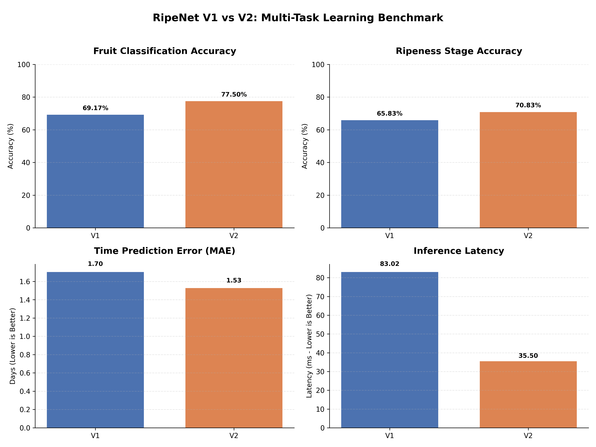

<p align="center">
  
</p>
<h1 align="center">RipeNet</h1>

RipeNet is an end-to-end computer vision suite for fruit species identification, ripeness classification, and shelf-life estimation using deep learning. The system utilizes multiple specialized models to provide a comprehensive analysis of fruit quality and remaining viability.

The core innovation of RipeNet is its transition from discrete classification to continuous regression, modeling shelf-life as a time-based value in days.

---

## Live Demo

- **Web Application**: [ripenet.vercel.app](https://ripenet.vercel.app)
- **Backend API**: [huggingface.co/spaces/alexcj10/ripenet-backend](https://huggingface.co/spaces/alexcj10/ripenet-backend)
- **CLI Tool**: Included in this repository! (See below for setup)

---

## Command Line & API Access

For **Developers** and **Power Users** who prefer the terminal, RipeNet offers two advanced access methods:

### Option 1: Premium CLI (Best Experience)
**Requires**: Python 3.7+

This is the official terminal tool for power users. **Choose ONE of the two methods below** to install the `ripenet` command:

#### Method A: Fast Install (Requires Git)
Best for users who want to install directly without manual downloads.
```bash
pip install git+https://github.com/alexcj10/ripenet.git
```

#### Method B: Manual Install (For Developers)
Best if you have already downloaded/cloned the code manually.
1. Open your terminal **inside the project folder**.
2. Run: `pip install .`

---

### **Done!** 
After running **either** A or B, the `ripenet` command is now live on your machine! You can now run these from any terminal window:
- **Scan a single image**: `ripenet scan "path/to/fruit.jpg"`
- **Batch scan a folder**: `ripenet batch "path/to/folder"`
- **Check System & API Status**: `ripenet info`

> [!IMPORTANT]
> You only need to install once. Once installed, you can use `ripenet` from any folder forever (no need to be inside the project folder anymore).
>
> **Windows/PowerShell User?**
> If you see `ripenet: The term is not recognized`, run this command to fix your path:
> ```powershell
> $env:PATH += ";C:\Users\$env:USERNAME\AppData\Roaming\Python\Python313\Scripts"
> ```

---

### Option 2: Instant API (Zero Install)
**Requires**: Nothing but a terminal!
Works on **any laptop** (Mac, Windows, Linux) immediately.

1. **Run the One-Liner**:
   ```bash
   curl -F "file=@fruit.jpg" https://alexcj10-ripenet-backend.hf.space/predict
   ```

> [!TIP]
> **Windows Users**: If the `curl` command acts unexpectedly in PowerShell, try using **`curl.exe`** instead.
>
> **Troubleshooting `curl: (26)`**: If you see this error, it's often due to complex characters (commas, colons, etc.) in the filename. **Rename your file** to something simple like `fruit.png` and try again.
>
> **Paths with Spaces**: If your folder names have spaces (e.g., `unripe orange`), always wrap the path in double quotes: 
> `"C:\My Fruits\fresh apple.jpg"`
>
> **Local Files Only**: The CLI and API expect a file saved on your computer. If you have an online image, download it first before scanning!

---

## Compatibility Matrix

| Environment | **Premium CLI** | **Instant API** |
| :--- | :---: | :---: |
| **Windows** | Supported | Supported (`curl.exe`) |
| **macOS** | Supported | Supported |
| **Linux** | Supported | Supported |
| **Dependencies** | Python 3.7+ | None |

---

## Technical Overview

1.  **Identity Model**: A deep learning classifier that identifies the fruit species (supported: Apple, Banana, Mango, Orange, Papaya, Pineapple) to select appropriate biological decay parameters.
2.  **Classification Model**: A secondary check for discrete ripeness stages (Unripe, Fresh/Ripe, Rotten) to validate visual status.
3.  **Regression Model**: The primary engine that predicts estimated remaining shelf-life in days by analyzing surface features, color distribution, and texture degradation.

Note: RipeNet V2 (Production) utilizes a Multi-Task Learning (MTL) architecture where a single EfficientNet-B0 backbone processes identity, classification, and regression simultaneously. This reduces inference latency by over 50% compared to the original sequential architecture.

The system is deployed using a decoupled architecture:
- **Frontend**: React (Vite) hosted on Vercel with high-performance Framer Motion animations.
- **Backend**: FastAPI (Python) hosted on Hugging Face Spaces (Docker) leveraging 16GB RAM for rapid model inference.

---

## Key Features

- **Multi-Model Pipeline**: Automated flow from species identification to shelf-life prediction.
- **Continuous Regression**: Predicts shelf-life in days instead of static categories.
- **Pre-trained Backbones**: Leverage transfer learning with EfficientNet-B0 for high accuracy and low latency.
- **Natural Language Inference**: Generates varied, human-readable status reports.
- **Metric Verification**: Validated using Mean Absolute Error (MAE) and Root Mean Squared Error (RMSE).

---

## Project Structure

```
.
├── api/                    # Backend API (Hugging Face / Docker)
│   ├── main.py             # FastAPI Application logic
│   ├── Dockerfile          # Container configuration
│   └── requirements.txt    # CPU-optimized dependencies
│
├── frontend/               # React Web Application (Vercel)
│   ├── src/                # UI components and API logic
│   ├── App.jsx             # Main application flow
│   └── App.css             # Premium styling and glassmorphism
│
├── saved_models/           # Pre-trained model weights (.pth)
│   ├── best_model.pth             # Classification model
│   ├── best_identity_model.pth    # Species identification model
│   └── best_regression_model.pth  # Shelf-life regression model
│
├── src/                    # Training and logic for Classification
├── src_identity/           # Training and logic for Identity
├── src_regression/         # Training and logic for Regression
├── .gitignore              # Project-wide git ignore rules
└── requirements.txt        # Local environment dependencies
```

---

## Data Labeling Strategy

Regression targets are derived from fruit-specific decay curves. The systems use distinct labeling strategies to optimize for either discrete experts (Model 1) or multi-task correlation (Model 2).

### Model 1 Configuration (Original Sequential)
Labeling strategy focused on standard viability windows.

| Fruit   | Unripe Stage (Days) | Fresh Stage (Days) | Rotten Stage (Days) |
|---------|---------------------|--------------------|---------------------|
| Apple   | 10.0                | 5.0                | 2.0                 |
| Banana  | 6.0                 | 3.0                | 1.0                 |
| Orange  | 8.0                 | 4.0                | 2.0                 |
| Papaya  | 6.0                 | 3.0                | 1.0                 |

### Model 2 Configuration (MTL Production)
Labeling strategy optimized for 6 fruit species with robust boundary modeling.

| Fruit     | Unripe Stage (Days) | Fresh Stage (Days) | Rotten Stage (Days) |
|-----------|---------------------|--------------------|---------------------|
| Apple     | 10.0                | 5.0                | 0.0                 |
| Banana    | 6.0                 | 3.0                | 0.0                 |
| Mango     | 7.0                 | 3.0                | 0.0                 |
| Orange    | 8.0                 | 5.0                | 0.0                 |
| Papaya    | 5.0                 | 2.0                | 0.0                 |
| Pineapple | 6.0                 | 3.0                | 0.0                 |

Additional Refinements in Model 2:
- **Spoilage Modeling**: For very spoiled or black fruit, targets are set to a random range between -1.0 and -3.0 to force the model to learn expiration depth beyond the zero-day threshold.
- **Data Jittering**: A small variation (e.g., +/- 0.2) is added to global labels to enhance sensitivity and prevent the model from over-fitting to fixed integer values.

---

## Benchmarking and Validation

To validate the production readiness of RipeNet V2, a professional benchmark was conducted against the original V1 baseline using a held-out test set.

### Methodology
Testing was performed on a dataset of 120 images, randomly collected at a rate of 10 images per class for the 4 primary common fruits (Apple, Banana, Orange, Papaya) across 3 ripeness stages. This ensures a balanced, unbiased comparison.

### Performance Comparison
The results demonstrate significant gains in both accuracy and computational efficiency for the V2 architecture.



| Metric | RipeNet V1 (Baseline) | RipeNet V2 (MTL) | Development ROI |
| :--- | :--- | :--- | :--- |
| **Fruit Identity Accuracy** | 69.17% | **77.50%** | +12.0% Improvement |
| **Stage Accuracy** | 65.83% | **70.83%** | +7.6% Improvement |
| **Error (MAE)** | 1.70 Days | **1.53 Days** | -10.3% Error Reduction |
| **Avg Latency** | 83.02 ms | **35.50 ms** | **~2.3x Faster** |

The V2 Multi-Task Backbone achieves faster inference by sharing feature extraction across all three task heads in a single forward pass.

---

## Evaluation Results

Performance metrics recorded during the final validation phases:

### RipeNet V1 (Original Metrics)
- **Classification Accuracy**: 92.6%
- **Identity Model Accuracy**: 93.6%
- **Regression Mean Absolute Error (MAE)**: 0.74 days

### RipeNet V2 (Production MTL Metrics)
- **Fruit Identification Accuracy**: 93.3%
- **Ripeness Stage Accuracy**: 80.4%
- **Regression Mean Absolute Error (MAE)**: 1.26 days

Note: RipeNet V2 training was conducted over 15 epochs with an un-frozen EfficientNet backbone, allowing for higher fidelity feature representations tailored to the 6-fruit classification task.

---

## Analysis of Metric Variance: Internal Validation vs. External Benchmarking

A distinction must be made between internal validation metrics recorded during model development and the results of the independent external benchmark.

During the internal training and validation phase, performance was measured against the models' respective original data splits:
- **RipeNet V1 Internal MAE**: 0.74 Days
- **RipeNet V2 Internal MAE**: 1.26 Days

The **External Benchmark** presented in this report was conducted on an entirely independent, balanced test set of 120 images to assess architectural robustness and generalization:
- **RipeNet V1 External MAE**: 1.70 Days
- **RipeNet V2 External MAE**: 1.53 Days

### Interpretation of Generalization Performance
While RipeNet V1 achieved higher precision on its internal split, the external benchmark reveals a significant increase in error when exposed to unseen data (0.74 to 1.70). This suggests a higher degree of architectural overfitting to its original training distribution.

In contrast, the Multi-Task Learning (MTL) design of RipeNet V2 demonstrates superior generalization. By achieving a lower regression error (1.53 MAE) and higher identification accuracy on the independent benchmark set, RipeNet V2 proves more robust for real-world deployment. The benchmark results provide a high-confidence estimation of performance in production environments where data variety is higher than in controlled training sets.

---

## Usage

### Environment Setup
```bash
pip install -r requirements.txt
```

### Automated Inference
To analyze an image and generate a shelf-life report:
```bash
python src/predict.py path/to/image.jpg
```

The script will automatically execute the identity model, followed by the classification and regression models, to produce a unified result.

---

## Why Regression?

| Stage-based Classification | Time-based Regression |
|----------------------------|-----------------------|
| Discrete labels (Ripe/Rotten)| Continuous days remaining |
| No granularity within stages | Captures progression of decay |
| Informational only          | Actionable for logistics/inventory |

---

## Dependencies

- [x] PyTorch
- [x] Torchvision
- [x] Pandas
- [x] Scikit-learn
- [x] Pillow (PIL)
- [x] NumPy 

---

## Author

Alex (alexcj10)

This system was developed as a case study in applying Deep Learning to solve food waste and quality control challenges in the agricultural sector.


